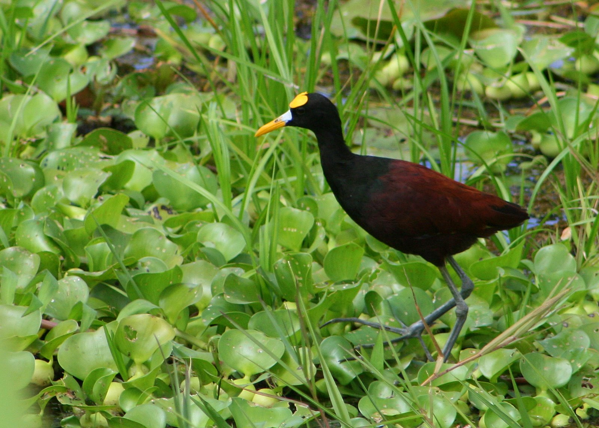
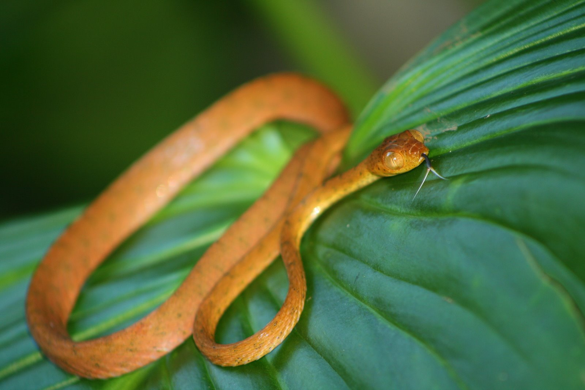
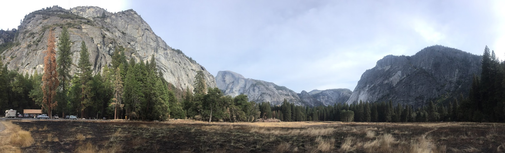

<h2>Daniel Sprockett</h2>
is a PhD student in [David Relman's Lab](http://med.stanford.edu/relmanlab.html) at Stanford University.  
His research interests include analyzing complex datasets in R, the human microbiome, and host/pathogen co-evolution. 
 
[Staford Profile](https://profiles.stanford.edu/daniel-sprockett)
 

<a itemprop="sameAs" content="https://orcid.org/0000-0003-2620-7555" href="https://orcid.org/0000-0003-2620-7555" target="orcid.widget" rel="noopener noreferrer" style="vertical-align:top;">orcid.org/0000-0003-2620-7555</a>

 
 
Dan is an avid photographer, 
helped organize The Stanford Center for Human Microbiome Studies's [Microbiome Summit](https://iti.stanford.edu/center-for-human-microbiome-studies/microbiome-summit.html), 
and recently became a founding member of the [Stanford Science Policy Group](https://twitter.com/SpgStanford).

***

Photography

One day I'll get around to adding a full gallery, but until then, here is just a sample.

